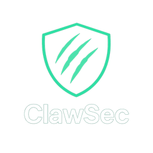

<p align="center">
  
</p>

<p align="center">
  <a href="https://github.com/LF3551/ClawSec/actions">
    
  </a>
  <a href="LICENSE">
    
  </a>
  <a href="https://github.com/LF3551/ClawSec">
    
  </a>
  <a href="https://github.com/LF3551/ClawSec/releases">
    
  </a>
  <a href="https://github.com/LF3551/ClawSec/stargazers">
    
  </a>
</p>

Modern encrypted network tool evolved from Cryptcat with state-of-the-art cryptography.


## Why ClawSec?

| Feature | ClawSec | Cryptcat | Ncat (--ssl) | socat (openssl) |
|---------|---------|----------|--------------|---------------|
| **Encryption** | AES-256-GCM | Twofish (deprecated) | TLS 1.3 | TLS 1.3 |
| **Key Exchange** | X25519 ECDHE | None | TLS handshake | TLS handshake |
| **Perfect Forward Secrecy** | ✅ Yes | ❌ No | ✅ Yes | ✅ Yes |
| **Authentication** | Password-bound ECDHE | None | Certificate | Certificate |
| **Setup** | Single password | Hardcoded key | Certificate required | Certificate required |
| **Replay Protection** | ✅ Sequence counters | ❌ No | ✅ TLS | ✅ TLS |
| **UDP Support** | ✅ `-u` flag | ❌ No | ✅ Yes | ✅ Yes |
| **IPv6** | ✅ `-4`/`-6` flags | ❌ No | ✅ Yes | ✅ Yes |
| **Lightweight** | ✅ ~50KB | ✅ Small | ❌ ~3MB (nmap) | ❌ ~400KB |
| **Drop-in Netcat** | ✅ Yes | ✅ Yes | ⚠️ Partial | ❌ No |
| **Shell Completions** | ✅ bash/zsh/fish | ❌ No | ❌ No | ❌ No |
| **Keep-Open** | ✅ `-K` multi-client | ❌ No | ✅ Yes | ✅ Yes |
| **Port Forwarding** | ✅ `-L` (no SSH) | ❌ No | ❌ No | ✅ Yes |
| **Traffic Obfuscation** | ✅ `--obfs http/tls` | ❌ No | ❌ No | ❌ No |
| **TLS Camouflage** | ✅ `--obfs tls` (TLS 1.3) | ❌ No | ❌ No | ❌ No |
| **TLS Fingerprinting** | ✅ `--fingerprint` (Chrome/FF/Safari) | ❌ No | ❌ No | ❌ No |
| **TOFU Identity** | ✅ `--tofu` (SSH-like known_hosts) | ❌ No | ❌ No | ❌ No |
| **Encrypted Client Hello** | ✅ `--ech` (GREASE ECH) | ❌ No | ❌ No | ❌ No |
| **Active Probing Resistance** | ✅ `--fallback` (REALITY-like) | ❌ No | ❌ No | ❌ No |
| **Stream Multiplexing** | ✅ `--mux` (64 streams) | ❌ No | ❌ No | ❌ No |
| **Anti-Traffic-Analysis** | ✅ `--pad` + `--jitter` | ❌ No | ❌ No | ❌ No |
| **Compression** | ✅ `-z` zlib | ❌ No | ❌ No | ❌ No |
| **Progress Bar** | ✅ `-P` built-in | ❌ No | ❌ No | ❌ No |
| **File Verification** | ✅ `-V` SHA-256 | ❌ No | ❌ No | ❌ No |
| **Zero Dependencies** | ✅ libssl only | ✅ | ❌ nmap suite | ❌ |

Perfect for: Secure file transfers, reverse shells, encrypted tunnels without certificate management.

## Security Features

- **AES-256-GCM**: Authenticated encryption with integrity verification
- **X25519 ECDHE**: Perfect Forward Secrecy — each session has unique ephemeral keys
- **PBKDF2**: Password-based key derivation with 100,000 iterations
- **Random Session Salt**: Per-session salt exchange prevents key reuse across sessions
- **Replay Protection**: Message sequence counters reject duplicated/reordered packets
- **Secure Random IV**: Cryptographically strong per-message randomization
- **Protocol Versioning**: Future-proof binary message format
- **Memory Safety**: Secure key wiping and resource cleanup

### Anti-Censorship / Anti-DPI

| Feature | Flag | What it does |
|---------|------|--------------|
| TOFU Identity | `--tofu` | SSH-like Ed25519 server identity + known_hosts |
| TLS Camouflage | `--obfs tls` | Wraps connection in a real TLS 1.3 session |
| Browser Mimicry | `--fingerprint chrome\|firefox\|safari` | Shapes ClientHello to match a real browser (JA3/JA4) |
| Encrypted Client Hello | `--ech` | Hides SNI from DPI with GREASE ECH extension |
| Active Probing Resistance | `--fallback host:port` | DPI probes see a real website; only ClawSec gets the tunnel |
| Packet Padding | `--pad` | All packets become uniform 1400 bytes |
| Timing Jitter | `--jitter N` | Random 0-N ms delay defeats timing correlation |

## Quick Start

### Automatic Installation

```bash
# Clone repository
git clone https://github.com/LF3551/ClawSec.git
cd ClawSec

# Run installer
chmod +x install.sh
./install.sh
```

### Manual Build

```bash
cd unix
make linux    # Linux with system OpenSSL
make macos    # macOS with Homebrew OpenSSL
make alpine   # Alpine Linux (Docker)
make freebsd  # FreeBSD
make netbsd   # NetBSD
```

### Docker

```bash
# Build image
docker build -t clawsec .

# Run server
docker run -p 8888:8888 clawsec -l -p 8888 -k "YourPassword"

# Or use docker-compose
docker-compose up
```

### Basic Usage

ClawSec supports three main modes: **Chat Mode**, **Reverse Shell Mode**, and **File Transfer Mode**.

#### 1. Chat Mode (Encrypted Communication)

Secure encrypted chat with session fingerprints, read receipts, inline file sharing, and slash commands.

**Server:**
```bash
./clawsec -l -p 8888 -k "TestPass123" -c -n "Alice"
```

**Client:**
```bash
./clawsec -k "TestPass123" -c -n "Bob" server-ip 8888
```

**Features:**
- 🔐 **Session fingerprint**: emoji + hex fingerprint shown at connect — verify both sides match to confirm no MITM
- 📛 **Custom nicknames** (`-n`): display names instead of Server/Client
- ✓✓ **Read receipts**: automatic delivery confirmations
- 📎 **Inline file sharing**: `/file path` sends files up to 4MB through the chat
- 🏓 **Encrypted ping**: `/ping` measures RTT through the encrypted tunnel
- Slash commands: `/file`, `/ping`, `/clear`, `/whoami`, `/help`
- Colored timestamps: green for local, cyan for remote
- Session duration shown on disconnect
- All communication encrypted with AES-256-GCM + PFS

#### 2. Reverse Shell Mode (Encrypted Remote Access)

Get encrypted command-line access to a remote machine.

**Server (target machine):**
```bash
cd ~/ClawSec/unix
./clawsec -l -p 8888 -k "TestPass123" -e /bin/bash
```

**Client (your machine):**
```bash
./clawsec -k "TestPass123" server-ip 8888
```

**Features:**
- Full encrypted shell access to target
- Run commands: `ls`, `cd`, `cat`, `ps`, `whoami`, `pwd`, etc.
- All traffic encrypted end-to-end
- Clean output without formatting

**Note**: Interactive programs (`nano`, `vim`, `top`) are now supported with PTY (pseudo-terminal). Use Ctrl+C to terminate programs, and `exit` or Ctrl+D to close the shell.

#### 3. File Transfer Mode (Secure File Transmission)

Transfer files with compression, progress bar, and SHA-256 verification.

**Server (receiving machine):**
```bash
./clawsec -v -l -p 8888 -k "FilePass123" > received_file.py
```

**Client (sending machine):**
```bash
./clawsec -v -k "FilePass123" server-ip 8888 < file_to_send.py
```

**With compression, progress & verification:**
```bash
# Server
./clawsec -l -p 8888 -k "FilePass123" -z -P -V > received.tar.gz

# Client
./clawsec -k "FilePass123" -z -P -V server-ip 8888 < archive.tar.gz
```

**Features:**
- `-z` zlib compression: reduces bandwidth 3-5x for text files
- `-P` built-in progress bar with speed and bytes (no external `pv` needed)
- `-V` SHA-256 end-to-end verification: hash sent after transfer, receiver verifies
- Automatic connection close after transfer
- Transfer statistics: `[Transfer complete] Sent/Received X bytes`
- Files transferred with full AES-256-GCM encryption
- Supports any file type (text, binary, archives)

**Advanced Examples:**

```bash
# Transfer archive
tar -czf - /path/to/directory | ./clawsec -k "pass" server 9999
./clawsec -l -p 9999 -k "pass" | tar -xzf -

# Transfer with progress (requires pv)
pv largefile.iso | ./clawsec -k "pass" server 7777
./clawsec -l -p 7777 -k "pass" > largefile.iso
```

## Requirements

- **OpenSSL 3.x**: For AES-GCM encryption
- **GCC/G++**: C++11 or later
- **POSIX System**: Linux, BSD, macOS, Solaris

### Install OpenSSL

```bash
# macOS
brew install openssl@3

# Debian/Ubuntu
sudo apt-get install libssl-dev

# RedHat/CentOS
sudo yum install openssl-devel
```

## Usage

```
Usage: clawsec [options] hostname port
       clawsec -l -p port [options]

Required:
  -k password       Encryption password (REQUIRED)

Connection:
  -l                Listen mode for inbound connections
  -p port           Local port number

Options:
  -c                Chat mode with timestamps and colors
  -v                Verbose mode
  -z                Compress data with zlib before encryption
  -P                Show transfer progress bar
  -V                SHA-256 end-to-end file verification
  -n name           Chat nickname (default: Server/Client)
  -K                Keep-open: accept multiple clients
  -L host:port      Port forwarding (encrypted tunnel)
  --obfs http       Traffic obfuscation (anti-DPI)
  --obfs tls        TLS 1.3 camouflage (stealth mode)
  --ech             Encrypted Client Hello (hide SNI from DPI)
  --mux             Multiplex streams over one tunnel (with -L)
  --fallback h:p    Proxy non-ClawSec probes to real site (REALITY-like)
  --tofu            Trust On First Use (SSH-like server identity)
  --fingerprint p   Mimic browser TLS (chrome, firefox, safari)
  --pad             Pad packets to uniform 1400 bytes
  --jitter ms       Random delay 0-N ms between packets
  -w secs           Timeout for connects
  -e prog           Execute program after connect (requires GAPING_SECURITY_HOLE)
```

## Examples

### Chat Mode
```bash
# Server: Listen for encrypted chat
./clawsec -l -p 8888 -k "TestPass123" -c -n "Alice"

# Client: Connect to server for chat
./clawsec -k "TestPass123" -c -n "Bob" server-ip 8888
```

Both sides see:
```
╔══════════════════════════════════════╗
║    🔐 ClawSec Encrypted Chat         ║
╚══════════════════════════════════════╝
  🔐 Session: a3f2-81bc-44de-9f71  🔒🌟💎🚀🍀🌸
  Verify this matches on both sides to confirm no MITM.
  Type /help for commands

  📛 Peer identified as: Bob
[10:30:15 Alice] Hello!
  ✓✓ delivered
[10:30:18 Bob] Hi! Check /ping
  ✓✓ delivered
  🏓 Pong: 12 ms RTT
```

### Reverse Shell Mode
```bash
# Server: Provide encrypted shell access
./clawsec -l -p 8888 -k "TestPass123" -e /bin/bash

# Client: Connect and execute commands
./clawsec -k "TestPass123" server-ip 8888
ls
pwd
whoami
```

### File Transfer Mode
```bash
# Server: Receive file with statistics
./clawsec -v -l -p 8888 -k "FilePass123" > received.py

# Client: Send file
./clawsec -v -k "FilePass123" server-ip 8888 < file.py

# With compression + progress + verification
./clawsec -z -P -V -l -p 8888 -k "FilePass123" > received.iso
./clawsec -z -P -V -k "FilePass123" server-ip 8888 < file.iso
```

Output:
```
[Sent] 42.3 MB  (12.5 MB/s)
[Transfer complete] Sent 88000000→42300000 bytes (compressed)
[Verify] SHA-256 OK: ba7816bf8f01cfea...
```

### Advanced Examples
```bash
# Transfer directory as archive
tar -czf - /data | ./clawsec -k "pass" server 9999
./clawsec -l -p 9999 -k "pass" | tar -xzf -

# Verbose debug mode
./clawsec -vv -l -p 8080 -k "debug"


## Security Guidelines

### Password Requirements

**Strong passwords:**
- Minimum 12 characters recommended
- Mix of uppercase, lowercase, numbers, symbols
- Example: `MyS3cur3Tr@nsf3r2025`

**Avoid:**
- Default passwords
- Dictionary words
- Short passwords (less than 8 characters)

### Operational Security

1. Never hardcode passwords in scripts
2. Use environment variables for automation
3. Clear command history after use
4. Share passwords through secure channels only

```bash
# Using environment variables
export CLAW_KEY="YourSecurePassword"
clawsec -l -p 1234 -k "$CLAW_KEY"
```

## Cryptographic Specifications

| Component | Algorithm | Parameters |
|-----------|-----------|------------|
| Cipher | AES-256 | 256-bit key |
| Mode | GCM | AEAD with authentication |
| Key Derivation | PBKDF2-HMAC-SHA256 | 100,000 iterations |
| IV | CSPRNG | 96 bits (12 bytes) |
| Auth Tag | GMAC | 128 bits (16 bytes) |

### Protocol Format

```
[MAGIC:4][VERSION:2][FLAGS:2][SEQ:4][LENGTH:4][IV:12][TAG:16][CIPHERTEXT]
```

- Magic number: `0x434C4157` ("CLAW")
- Version: `0x0001` (protocol v1)
- Sequence number: monotonic counter (replay protection)
- Automatic authentication and integrity verification

### Session Handshake

```
Client ──TCP connect──▶ Server
Client ◀──X25519 pubkey (32B)── Server
Client ──X25519 pubkey (32B)──▶ Server
       [Both: key = SHA256(ECDH_secret || PBKDF2(password))]
Client ◀──encrypted messages──▶ Server
```

Perfect Forward Secrecy: even if password is later compromised,
previously recorded sessions cannot be decrypted.

See [SECURITY.md](SECURITY.md) for detailed cryptographic documentation.

## Comparison

| Feature | ClawSec | Original Cryptcat | Netcat |
|---------|---------|-------------------|--------|
| Encryption | AES-256-GCM | Twofish (deprecated) | None |
| Authentication | GCM Tag | None | None |
| Key Derivation | PBKDF2 | Direct key | N/A |
| Memory Safety | Secure wiping | No | N/A |
| Protocol Version | Yes | No | N/A |

## Testing

```bash
# Run integration test suite (58 tests)
cd unix
make macos    # or: make linux
make test XFLAGS='-I/opt/homebrew/opt/openssl@3/include' XLIBS='-L/opt/homebrew/opt/openssl@3/lib -lssl -lcrypto -lstdc++'

# On Linux (system OpenSSL):
make linux && make test
```

Test coverage:
- Encrypt/decrypt roundtrip
- Multi-message sequencing
- Random salt generation & uniqueness
- Different salts → different ciphertext
- Wrong password rejection
- Replay protection (duplicated packets rejected)
- Large messages (8KB)
- Input validation (NULL/empty password, invalid salt)
- Protocol magic validation
- Full handshake simulation
- Bidirectional communication
- Obfuscation (HTTP mode send/recv, multi-message, large payload)
- Host:port parsing (IPv4, IPv6, hostname, invalid)
- Zlib compress/decompress roundtrip
- SHA-256 known vector and incremental hashing
- Session fingerprint determinism
- Control message protocol format
- farm9crypt_initialized state tracking
- Raw 32-byte key initialization
- Fingerprint error when uninitialized
- write_all full buffer correctness
- TLS camouflage accept/connect roundtrip
- Packet padding/unpadding roundtrip
- Padding uniform size across different inputs
- Padding rejects oversized input
- Timing jitter applies delay
- Timing jitter(0) is no-op

```bash
# Manual connection test (two terminals)
# Terminal 1:
./clawsec -l -p 12345 -k "TestPassword" -v

# Terminal 2:
echo "Test message" | ./clawsec localhost 12345 -k "TestPassword"
```

## Troubleshooting

### "Encryption not initialized"
Missing `-k` password option. Always provide password parameter.

### "Decryption/authentication failed"
Password mismatch or corrupted data. Verify both endpoints use identical password.

### "Connection closed by peer"
Protocol version mismatch or network error. Update both endpoints to same version.

### OpenSSL library errors
```bash
# macOS: Set OpenSSL paths
export CPPFLAGS="-I/opt/homebrew/opt/openssl@3/include"
export LDFLAGS="-L/opt/homebrew/opt/openssl@3/lib"
make clean && make linux
```

## Changelog

### Version 2.5.0 (May 2026) - Stealth Mode & PFS
- **TOFU (Trust On First Use)**: `--tofu` SSH-like server identity with Ed25519 + known_hosts
- **TLS Fingerprinting**: `--fingerprint chrome|firefox|safari` shapes ClientHello to match real browsers
- **Fallback (REALITY-like)**: `--fallback host:port` proxies DPI probes to a real website
- **Encrypted Client Hello**: `--ech` adds GREASE ECH extension, hides SNI from DPI
- **Stream Multiplexer**: `--mux` — 64 concurrent streams over one encrypted tunnel
- **ECDHE (X25519)**: Ephemeral key exchange provides Perfect Forward Secrecy
- **Password-authenticated ECDHE**: Password binds to key exchange, preventing MITM
- **TLS 1.3 Camouflage**: `--obfs tls` wraps connections in real TLS 1.3 sessions
- **Packet Padding**: `--pad` makes all packets uniform 1400 bytes
- **Timing Jitter**: `--jitter N` adds random 0-N ms delays between packets
- **Keep-Open**: `-K` multi-client server with fork per connection
- **Port Forwarding**: `-L host:port` encrypted tunnel without SSH
- **HTTP Obfuscation**: `--obfs http` anti-DPI packet wrapping
- **UDP mode** (`-u`): Encrypted datagrams over UDP with full AEAD protection
- **IPv6 support** (`-4`/`-6`): Explicit address family selection; dual-stack by default
- **Compression**: `-z` zlib, `-P` progress bar, `-V` SHA-256 verification
- **Chat Enhancements**: Fingerprints, receipts, `/file`, `/ping`, nicknames
- **Man page**: Added `clawsec.1` for `man clawsec`
- **Shell completions**: Bash, Zsh, and Fish autocompletion scripts
- **Test Suite**: 58 integration tests covering crypto, protocol, stealth, ECH, mux, fallback, fingerprint, TOFU, and more

### Version 2.4.0 (May 2026) - Security Hardening
- **Random Session Salt**: Per-session CSPRNG salt exchange replaces fixed salt
- **Replay Protection**: Message sequence counters prevent replay/reorder attacks
- **Makefile Fix**: Removed hardcoded Homebrew paths; added dedicated `make macos` target
- **Build**: `make linux` now works on standard Linux without Homebrew

### Version 2.3.0 (November 2025) - Complete Rewrite
- **Code Modernization**: Rewritten from 1714 lines to 439 lines (75% reduction)
- **Binary Size**: Reduced from 72KB to 37KB (48% smaller)
- **Standards**: Modern C99/POSIX replacing legacy K&R C
- **Architecture**: Clean function separation, local scope, proper error handling
- **Chat Mode**: Added timestamps and colored output (server-side)
- **File Transfer**: Auto-close with statistics
- **Removed**: Legacy `generic.h`, obsolete compatibility code

### Version 2.0 (November 2025) - Security Overhaul
- Added AES-256-GCM authenticated encryption
- Added PBKDF2 password-based key derivation
- Added protocol versioning with magic number
- Removed hardcoded default password
- Implemented secure random IV generation
- Added memory wiping for sensitive data
- Improved error handling
- Comprehensive security documentation

### Version 1.x (Legacy Cryptcat)
- Twofish encryption (deprecated)
- Direct key usage (insecure)

## Contributing

Contributions are welcome. Please:

1. Review [SECURITY.md](SECURITY.md) before submitting security-related changes
2. Test thoroughly
3. Document all changes
4. Follow existing code style

## License

Based on Netcat and Cryptcat. See [LICENSE](LICENSE) for details.

## Legal Notice

This tool is for authorized testing and legitimate use only.

- Obtain permission before testing networks
- Comply with all applicable laws and regulations
- Authors not responsible for misuse or unauthorized access
- Use at your own risk

## Credits

- Original Netcat: Hobbit
- Original Cryptcat: Farm9 team
- ClawSec Modernization: 2025 security enhancements
- OpenSSL Project: Cryptographic library

## Documentation

- [SECURITY.md](SECURITY.md) - Detailed security documentation
- [EXAMPLE_USAGE.md](EXAMPLE_USAGE.md) - Usage examples
- [FAQ.md](FAQ.md) - Frequently asked questions
- [CHANGELOG.md](CHANGELOG.md) - Version history
- [CONTRIBUTING.md](CONTRIBUTING.md) - Development guide
- [OpenSSL GCM Documentation](https://wiki.openssl.org/index.php/EVP_Authenticated_Encryption_and_Decryption)
- [NIST SP 800-38D](https://csrc.nist.gov/publications/detail/sp/800-38d/final) - GCM Specification
- [PBKDF2 RFC 8018](https://tools.ietf.org/html/rfc8018)
